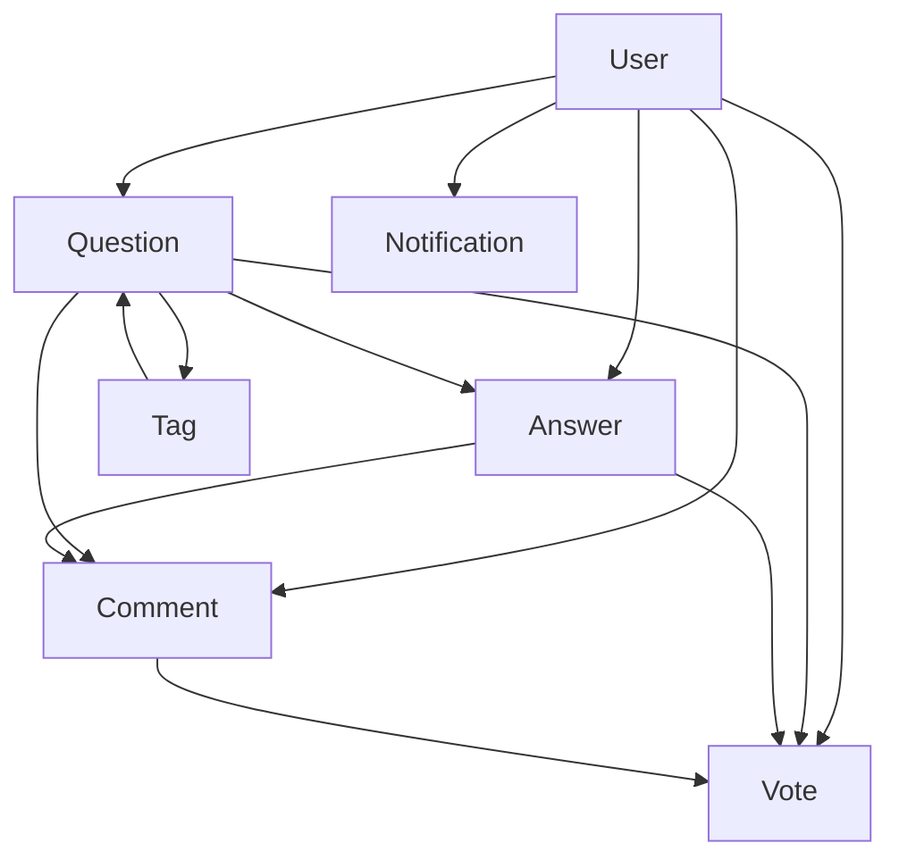

# 🗄️ StackIt Database Models

  

## 📋 Overview

This directory contains **7 sophisticated database models** for the StackIt Q&A platform, built with **Mongoose ODM** and **ES6 modules**. Each model is designed with modern features, comprehensive validation, and advanced functionality.

## 🏗️ Architecture

```
models/
├── User.model.js          # 👤 User management & authentication
├── Question.model.js      # ❓ Question system with rich content
├── Answer.model.js        # 💬 Answer system with quality metrics
├── Tag.model.js           # 🏷️ Smart tagging & categorization
├── Comment.model.js       # 💭 Threading comment system
├── Notification.model.js  # 🔔 Multi-channel notifications
├── Vote.model.js          # 🗳️ Advanced voting with fraud detection
└── index.js               # 📦 Centralized model exports
```

## 🚀 Quick Start

### Import Models

```javascript
// Import all models
import { User, Question, Answer, Tag, Comment, Notification, Vote } from './models/index.js';

// Import specific models
import User from './models/User.model.js';
import Question from './models/Question.model.js';
```

### Basic Usage Example

```javascript
// Create a new user
const user = new User({
  username: 'johndoe',
  email: 'john@example.com',
  password: 'securePassword123',
  profile: {
    firstName: 'John',
    lastName: 'Doe',
    bio: 'Full-stack developer passionate about clean code'
  }
});

await user.save();

// Create a question
const question = new Question({
  title: 'How to implement authentication in Node.js?',
  body: 'I need help implementing secure JWT authentication...',
  author: user._id,
  tags: [mongoTag._id, nodeTag._id],
  category: 'technical'
});

await question.save();
```

## 📚 Model Documentation

### 👤 **User Model** (`User.model.js`)

The most comprehensive user management system with advanced features.

#### **Core Features:**
- 🔐 **Authentication**: Password hashing, JWT tokens, 2FA support
- 👥 **Profile System**: Avatar, bio, social links, location
- 🏆 **Reputation**: Dynamic scoring, badges, achievements
- 🔒 **Security**: Login attempts, account locking, password reset
- 📊 **Activity Tracking**: Questions, answers, votes, last active
- 👥 **Social Features**: Following/followers, saved content
- ⚙️ **Preferences**: Theme, notifications, privacy settings

#### **Key Methods:**
```javascript
// Authentication
user.comparePassword(candidatePassword)
user.generateAuthToken()
user.incLoginAttempts()

// Reputation management
user.updateReputation(points, reason)

// Static methods
User.findByCredentials(identifier)
User.getLeaderboard(limit)
```

#### **Schema Highlights:**
```javascript
{
  username: { type: String, unique: true, required: true },
  email: { type: String, unique: true, required: true },
  password: { type: String, required: true, select: false },
  profile: {
    firstName: String,
    lastName: String,
    bio: String,
    avatar: { url: String, publicId: String },
    location: String,
    website: String,
    socialLinks: { github: String, linkedin: String, twitter: String }
  },
  reputation: {
    score: { type: Number, default: 0 },
    badges: [{ name: String, icon: String, earnedAt: Date }],
    achievements: [String]
  },
  // ... 50+ more fields
}
```

---

### ❓ **Question Model** (`Question.model.js`)

Advanced question system with rich content support and analytics.

#### **Core Features:**
- 📝 **Rich Content**: HTML, Markdown, block-based editing
- 🗳️ **Voting System**: Detailed upvote/downvote tracking
- 📎 **Media Support**: Image uploads, attachments
- 🔍 **SEO Optimization**: Meta tags, canonical URLs, slugs
- 📊 **Analytics**: Views, unique viewers, trending algorithms
- 🛡️ **Moderation**: Flags, review system, content approval
- 📚 **Collaboration**: Edit history, version control
- 💰 **Bounty System**: Reward system for answers

#### **Key Methods:**
```javascript
// Voting
question.hasUserVoted(userId)
question.addVote(userId, voteType)

// Analytics
question.incrementViews(userId, ipAddress)

// Static methods
Question.getTrending(timeframe)
Question.search(query, filters)
```

#### **Virtual Properties:**
```javascript
question.voteScore     // Calculated vote score
question.answerCount   // Number of answers
question.readingTime   // Estimated reading time
question.url           // SEO-friendly URL
```

---

### 💬 **Answer Model** (`Answer.model.js`)

Intelligent answer system with quality metrics and AI analysis.

#### **Core Features:**
- 🎯 **Quality Metrics**: Helpfulness, clarity, completeness scores
- 💻 **Code Support**: Syntax highlighting, multiple languages
- 🤖 **AI Features**: Content analysis, suggestions, fact-checking
- 📈 **Performance Tracking**: Load times, engagement metrics
- 🏅 **Endorsement System**: Skill validation, community recognition
- 🔗 **Threading**: Reply system with parent-child relationships
- 📚 **References**: External links and resources

#### **Key Methods:**
```javascript
// Voting and acceptance
answer.addVote(userId, voteType)
answer.acceptAnswer(acceptedBy)

// Bookmarking
answer.addBookmark(userId)
answer.removeBookmark(userId)

// Static methods
Answer.getTopAnswers(limit, timeframe)
Answer.getUserBestAnswers(userId, limit)
```

---

### 🏷️ **Tag Model** (`Tag.model.js`)

Smart tagging system with hierarchy and trending algorithms.

#### **Core Features:**
- 🎨 **Visual Customization**: Colors, icons, emojis
- 🌳 **Hierarchy Support**: Parent/child relationships, categories
- 📈 **Trending Algorithm**: Dynamic scoring, popularity tracking
- 👨‍🏫 **Expert System**: Tag experts, expertise levels
- 📚 **Learning Paths**: Structured learning recommendations
- 🌍 **Internationalization**: Multi-language support
- 🔍 **Search Optimization**: Synonyms, aliases

#### **Key Methods:**
```javascript
// Follower management
tag.addFollower(userId, notificationLevel)
tag.removeFollower(userId)

// Statistics
tag.incrementQuestionCount()
tag.updateTrendingScore()

// Static methods
Tag.getTrending(limit)
Tag.getPopular(limit)
Tag.searchTags(query, limit)
Tag.getRelatedTags(tagIds, limit)
```

---

### 💭 **Comment Model** (`Comment.model.js`)

Enhanced comment system with threading and reactions.

#### **Core Features:**
- 🧵 **Threading Support**: Nested replies with depth limits
- 😀 **Reactions**: Multiple emoji reactions, engagement tracking
- 🤖 **Quality Analysis**: AI-powered sentiment and toxicity detection
- 👥 **Collaborative Editing**: Multi-user editing capabilities
- 📎 **Rich Media**: Attachments, GIFs, videos
- 🌐 **Translation**: Multi-language support
- 🔗 **Mentions**: User tagging and notifications

#### **Key Methods:**
```javascript
// Voting and reactions
comment.addVote(userId, voteType)
comment.addReaction(userId, reactionType)
comment.removeReaction(userId)

// Editing and moderation
comment.editComment(newContent, editedBy, reason)
comment.flag(userId, reason, description)

// Static methods
Comment.getCommentsForTarget(targetType, targetId, options)
Comment.getTrendingComments(timeframe, limit)
```

---

### 🔔 **Notification Model** (`Notification.model.js`)

Advanced notification system with multi-channel delivery.

#### **Core Features:**
- 📱 **Multi-Channel**: In-app, email, push, SMS delivery
- 🎨 **Rich Content**: HTML templates, interactive buttons
- 📊 **Analytics**: Click rates, engagement tracking
- 🎯 **Personalization**: User preferences, timezone support
- 🧪 **A/B Testing**: Experiment tracking, variant testing
- 📦 **Aggregation**: Smart grouping of similar notifications
- ⏰ **Scheduling**: Delayed and scheduled notifications

#### **Key Methods:**
```javascript
// Status management
notification.markAsRead()
notification.dismiss()

// Analytics
notification.trackClick()
notification.trackImpression()

// Delivery tracking
notification.updateDeliveryStatus(channel, status)

// Static methods
Notification.getUnreadCount(userId)
Notification.getRecentForUser(userId, limit, offset)
Notification.markAllAsReadForUser(userId)
Notification.createNotification(data)
```

---

### 🗳️ **Vote Model** (`Vote.model.js`)

Sophisticated voting system with fraud detection and analytics.

#### **Core Features:**
- 🕵️ **Fraud Detection**: Bot detection, sockpuppet analysis
- 📍 **Context Tracking**: Device, timing, behavior patterns
- 🎯 **Quality Scoring**: Confidence levels, informed voting
- 📊 **Analytics**: Voting trends, controversial content detection
- ⚖️ **Weight System**: Dynamic vote weighting based on quality
- 📋 **Audit Trail**: Complete vote history and modifications
- 🧠 **Machine Learning**: Feature vectors, anomaly detection

#### **Key Methods:**
```javascript
// Vote management
vote.reverse(reason)
vote.flagAsSuspicious(reason, flaggedBy)
vote.verify(verifiedBy, method)
vote.calculateInfluenceScore()

// Static methods
Vote.getVoteStats(targetType, targetId)
Vote.detectVotingPatterns(userId, timeframe)
Vote.getControversialContent(targetType, limit)
Vote.getVotingTrends(period)
```

## 🔄 Relationships



## 📊 Database Indexes

### Performance Optimizations

Each model includes strategic indexes for optimal performance:

```javascript
// User indexes
userSchema.index({ email: 1 });
userSchema.index({ username: 1 });
userSchema.index({ 'reputation.score': -1 });

// Question indexes
questionSchema.index({ title: 'text', body: 'text' });
questionSchema.index({ author: 1, createdAt: -1 });
questionSchema.index({ tags: 1 });

// Vote indexes (compound for uniqueness)
voteSchema.index({ voter: 1, 'target.type': 1, 'target.question': 1 }, { unique: true });
```

## 🔧 Configuration

### Environment Variables

```env
# Database
MONGODB_URI=mongodb://localhost:27017/stackit
MONGODB_TEST_URI=mongodb://localhost:27017/stackit_test

# JWT
JWT_SECRET=your_super_secret_jwt_key_here
JWT_EXPIRES_IN=7d

# Security
BCRYPT_ROUNDS=12
MAX_LOGIN_ATTEMPTS=5
LOCK_TIME=2h

# File Upload
MAX_FILE_SIZE=5242880
UPLOAD_PATH=./uploads
CLOUDINARY_CLOUD_NAME=your_cloud_name
CLOUDINARY_API_KEY=your_api_key
CLOUDINARY_API_SECRET=your_api_secret
```

### Connection Setup

```javascript
import mongoose from 'mongoose';

const connectDB = async () => {
  try {
    const conn = await mongoose.connect(process.env.MONGODB_URI, {
      useNewUrlParser: true,
      useUnifiedTopology: true,
    });
    console.log(`✅ MongoDB Connected: ${conn.connection.host}`);
  } catch (error) {
    console.error('❌ Database connection failed:', error);
    process.exit(1);
  }
};

export default connectDB;
```

## 🧪 Testing

### Model Testing Examples

```javascript
import { User, Question, Answer } from '../models/index.js';

describe('User Model', () => {
  test('should hash password before saving', async () => {
    const user = new User({
      username: 'testuser',
      email: 'test@example.com',
      password: 'plaintext'
    });
    
    await user.save();
    expect(user.password).not.toBe('plaintext');
  });
  
  test('should generate valid JWT token', () => {
    const user = new User({ username: 'test', email: 'test@test.com' });
    const token = user.generateAuthToken();
    expect(token).toBeDefined();
  });
});
```

## 🔐 Security Features

### Built-in Security

- **Password Hashing**: bcrypt with configurable rounds
- **JWT Authentication**: Secure token generation and validation
- **Rate Limiting**: Login attempt tracking and account locking
- **Input Validation**: Comprehensive validation and sanitization
- **XSS Protection**: HTML content sanitization
- **Fraud Detection**: Advanced vote manipulation detection

### Best Practices

```javascript
// Always validate user input
const question = new Question({
  title: validator.escape(req.body.title),
  body: sanitizeHtml(req.body.body),
  author: req.user._id
});

// Use transactions for critical operations
const session = await mongoose.startSession();
session.startTransaction();
try {
  await question.save({ session });
  await user.updateReputation(5, 'question_posted', { session });
  await session.commitTransaction();
} catch (error) {
  await session.abortTransaction();
  throw error;
} finally {
  session.endSession();
}
```

## 📈 Performance Tips

### Optimization Strategies

1. **Use Projections**: Only fetch required fields
```javascript
const users = await User.find({}, 'username email profile.avatar');
```

2. **Implement Pagination**: Avoid loading large datasets
```javascript
const questions = await Question.find()
  .skip((page - 1) * limit)
  .limit(limit)
  .sort({ createdAt: -1 });
```

3. **Use Aggregation**: For complex queries
```javascript
const trendingTags = await Tag.aggregate([
  { $sort: { 'trending.score': -1 } },
  { $limit: 20 }
]);
```

4. **Cache Frequently Accessed Data**: Use Redis for hot data
```javascript
const cachedUser = await redis.get(`user:${userId}`);
if (!cachedUser) {
  const user = await User.findById(userId);
  await redis.setex(`user:${userId}`, 3600, JSON.stringify(user));
}
```

## 🚀 Advanced Usage

### Custom Validators

```javascript
// Custom email validator
const emailValidator = {
  validator: function(email) {
    return /^\w+([.-]?\w+)*@\w+([.-]?\w+)*(\.\w{2,3})+$/.test(email);
  },
  message: 'Please provide a valid email address'
};

// Usage in schema
email: {
  type: String,
  required: true,
  validate: emailValidator
}
```

### Middleware Examples

```javascript
// Pre-save middleware for automatic slug generation
questionSchema.pre('save', function(next) {
  if (this.isModified('title')) {
    this.slug = this.title
      .toLowerCase()
      .replace(/[^a-z0-9\s-]/g, '')
      .replace(/\s+/g, '-');
  }
  next();
});

// Post-save middleware for notifications
questionSchema.post('save', async function(doc) {
  if (this.isNew) {
    await Notification.createNotification({
      recipient: doc.author,
      type: 'question_published',
      title: 'Your question has been published!',
      message: `Your question "${doc.title}" is now live.`
    });
  }
});
```

## 📦 Dependencies

```json
{
  "mongoose": "^8.16.3",
  "bcryptjs": "^2.4.3",
  "jsonwebtoken": "^9.0.0",
  "validator": "^13.9.0",
  "sanitize-html": "^2.10.0"
}
```

## 🤝 Contributing

### Adding New Models

1. Create new model file following naming convention
2. Import and export in `index.js`
3. Add comprehensive validation and indexes
4. Include virtuals and methods
5. Write tests
6. Update this documentation

### Model Guidelines

- Use descriptive field names
- Include comprehensive validation
- Add appropriate indexes
- Implement useful virtuals and methods
- Handle errors gracefully
- Document complex logic

## 📝 Changelog

### Version 1.0.0 (Current)
- ✅ Complete model architecture
- ✅ ES6 module support
- ✅ Advanced validation
- ✅ Comprehensive indexing
- ✅ Rich feature set
- ✅ Security implementations

## 📄 License

This project is licensed under the MIT License - see the [LICENSE](../LICENSE) file for details.

---

**Built with ❤️ for the StackIt Q&A Platform**


